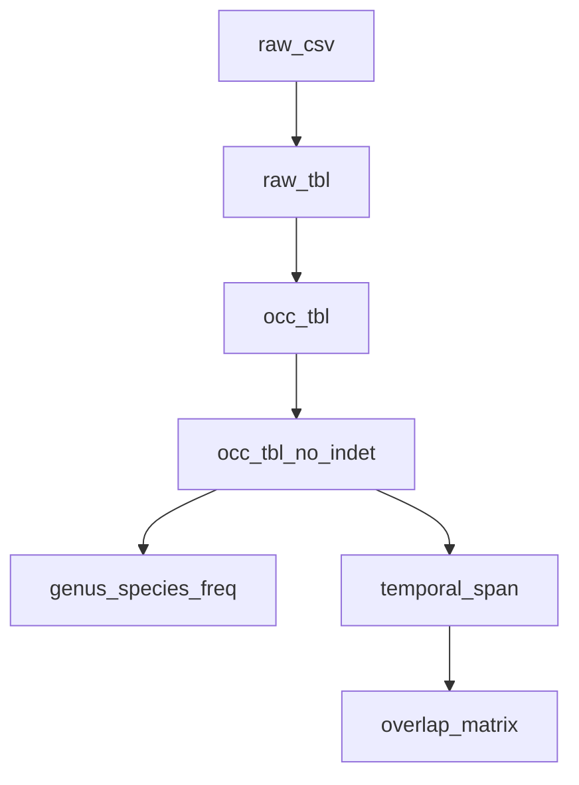

# Hominid Dates – Spatio‑Temporal Overlap of African Hominins

A fully reproducible **targets + renv** workflow that ingests a cleaned fossil database
(`data/hominid.csv`), collapses duplicate fragments into single occurrences, estimates
sampling intensity, and exports descriptive summaries ready for Solow OLE or occupancy
modelling.

> **Scope (v0.1)**  
> *No modelling yet – this stage ends with tidy summary artefacts.*

---

## Directory structure

```
hominid-dates/
├── bootstrap_env.R          # renv bootstrap & package pin
├── _targets.R               # declarative pipeline
├── R/                       # one helper per file (explicit imports)
│   ├── read_hominid.R
│   ├── collapse_fragments.R
│   ├── filter_indet.R
│   ├── summarise_freq.R
│   ├── summarise_spans.R
│   ├── calc_overlap.R
│   └── write_outputs.R
├── data/
│   └── hominid.csv          # cleaned input (index, id, lat, lon, date, upper, lower…)
├── outputs/                 # auto‑generated summary CSVs
└── README.md
```

---

## Quick start

```bash
git clone https://github.com/BWBrook/hominid-dates
cd hominid-dates

# one‑off environment bootstrap
Rscript bootstrap_env.R

# run the pipeline
R -e "targets::tar_make()"
```

### Typical RStudio session

```r
renv::restore()            # reproducible environment (fresh machine)
targets::tar_make()        # builds graph
targets::tar_visnetwork()  # interactive DAG
targets::tar_read(genus_species_freq)
```

---

## Target graph (conceptual)



### Key objects

| Target | Format | Description |
|--------|--------|-------------|
| `occ_tbl` | tibble | Deduplicated occurrences with `sampling_intensity`. |
| `occ_tbl_no_indet` | tibble | Same, but `species == "indet"` removed. |
| `genus_species_freq` | list | Specimen counts by genus & species (weighted). |
| `temporal_span` | data.frame | First / last appearances per species. |
| `overlap_matrix` | data.frame | Pairwise temporal overlap in Ma. |

---

## Reproducibility checklist

* **renv** – pinned versions in `renv.lock`.  
* **targets** – declarative, side‑effect‑free pipeline.  
* **Explicit imports** – every helper uses `import::from()`.  
* **Portable paths** – all files accessed via `here::here()`.  

Run:

```r
lintr::lint_package()     # style / lint
targets::tar_validate()   # pipeline sanity
```

---

## Roadmap

1. **v0.2** – Solow OLE per species (continental).  
2. **v0.3** – Site‑level occupancy state‑space model using `sampling_intensity`.  
3. **v0.4** – Interactive Shiny explorer for spatio‑temporal dynamics.

Contributions welcome – open an issue or PR.
